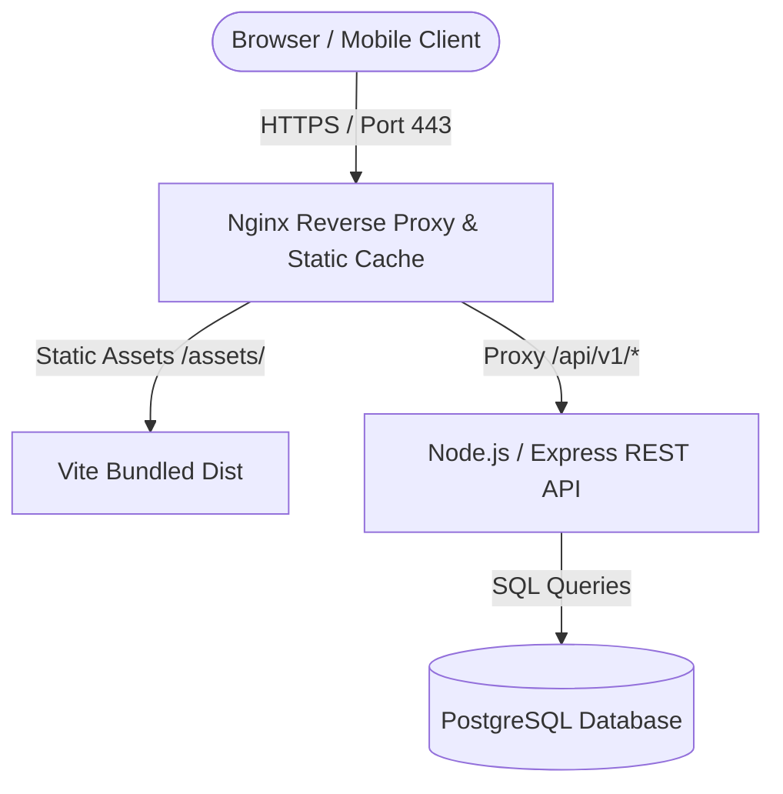

# System Architecture & Technical Design

## 1. Overview
DAYDAWN Productions is designed with a decoupled 3-tier production architecture:
1. **Edge / Presentation**: Nginx reverse proxy serving the compiled React 18 / Vite Single Page Application with HTTP caching and compression.
2. **Application Core**: Node.js & Express REST API with strict layered separation (Controllers, Services, Repositories, Models).
3. **Persistence**: PostgreSQL relational database with immutable, versioned migrations.

## 2. Separation of Concerns
- **UI Components**: Never execute network logic or raw `fetch()`. They consume typed services.
- **Services**: Coordinate business validation and call the centralized `apiClient`.
- **API Client**: Handles timeouts, standard headers, and wraps network issues into `ApiError`.
- **Backend Controllers**: Solely unpack request objects and format responses.
- **Backend Services**: Enforce business rules and domain logic.
- **Repositories**: Abstract database queries so data engines can be swapped without altering business code.
