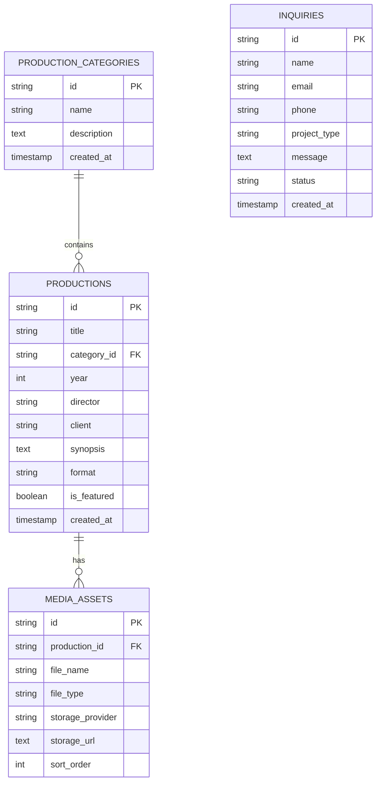

# Database Schema & Entity Relationships

The data storage layer uses PostgreSQL 16.

```mermaid
erDiagram
    PRODUCTION_CATEGORIES ||--o{ PRODUCTIONS : contains
    PRODUCTIONS ||--o{ MEDIA_ASSETS : has
    INQUIRIES {
        string id PK
        string name
        string email
        string phone
        string project_type
        text message
        string status
        timestamp created_at
    }
    PRODUCTION_CATEGORIES {
        string id PK
        string name
        text description
        timestamp created_at
    }
    PRODUCTIONS {
        string id PK
        string title
        string category_id FK
        int year
        string director
        string client
        text synopsis
        string format
        boolean is_featured
        timestamp created_at
    }
    MEDIA_ASSETS {
        string id PK
        string production_id FK
        string file_name
        string file_type
        string storage_provider
        text storage_url
        int sort_order
    }
```
